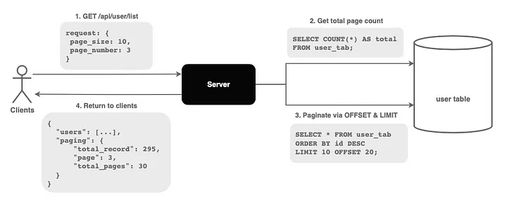

# API pagination

Page + Offset

<figure><figcaption></figcaption></figure>

```
API: GET /api/user/list

request: {
    page_size: 10,
    page_number: 3
}
```

```sql
SELECT COUNT(*) AS total FROM user_tab;
# Offset  = 10 * (3-1), Limit = page_size
SELECT * FROM user_tab ORDER BY id DESC LIMIT 10 OFFSET 30
```

However, cons are:

1. Result inconsistency
   * The database looks up for (offset + limit) number of records before discarding the unwanted ones and returning the remaining.
   * Hence, the query time increases drastically as the offset increases
2. Offset inefficiency — Doesn’t scale well with large dataset
   * If an item in a previous page is deleted, data will shift forward, causing some results to be skipped.
   * If an item in a previous page is added, data will shift backwards, causing some results to be duplicated.

### Cursor-based  <a href="#d99c" id="d99c"></a>

<figure><figcaption></figcaption></figure>

```
API: GET /api/user/list

request: {
    cursor: 12345,
    page_size: 10
}
```

<pre class="language-sql"><code class="lang-sql"># limit = page_size + 1
SELECT * FROM users WHERE id &#x3C;= %cursor 
ORDER BY id DESC
<strong>LIMIT %&#x3C;limit + 1>
</strong></code></pre>

* If the number of records returned is less than the `LIMIT`, it implies that we are on the last page.
* The extra record is not returned to the client. The `ID` of the extra record is passed back to the client as the `next_cursor`.

The cursor-based pagination scale well with large and rapid-changing datasets. However, it does not allow to jump to specific page. Also, the cursor must come from a unqiue and sequential column (for sorting).

Thus, if want to jump to specific page while keep the query performance, we can adopt a hybrid approach that maintains a cursor cache that maps page numbers to cursors.  When a user requests a specific page:

* It converts the page number to an offset
* It caches the cursor for that position
* Future requests can use either the page number or cursor

### Old

`LIMIT` specifies the maximum number of rows to return in the result set. For example, if you set `LIMIT` to 10, the result set will contain a maximum of 10 rows.

`OFFSET` specifies the number of rows to skip before beginning to return rows. For example, if you set `OFFSET` to 20 and `LIMIT` to 10, the result set will contain rows 21-30.

How offset and limit match pgno and pgsz:

* Page number: The page number represents the current page you want to display. For example, if you're displaying the third page, the page number would be 3.
* Page size: The page size represents the number of rows you want to display on each page. For example, if you're displaying 20 rows per page, the page size would be 20.
* OFFSET: The `OFFSET` value is calculated by multiplying the page number minus 1 by the page size. For example, if the page size is 20 and you want to display page 3, the `OFFSET` value would be 40 (i.e., `OFFSET` = (3 - 1) \* 20).
* LIMIT: The `LIMIT` value is simply set to the page size. For example, if the page size is 20, the `LIMIT` value would be 20.

#### Update

Noticed that response should include field `count`, which indicate how many records existing in DB so that FE can use that \`count\` with pgsz and pgno for rendering.
