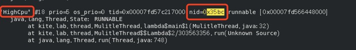

# How to trace high CPU usage thread

### Java

1. top/htop -> find the PID of process  that occupied highest %CPU&#x20;
2. top -Hp PID -> find the PID of thread under process PID

```bash
top -Hp 13731
```

1. In Java, we have tools like jstack, which helps to check all threads infomation of Java program.&#x20;

```bash
jstack 13731 > thread_stack.log
```

4. Noticed that jstack log store thread PID in hexdecimal, find the target thread

<figure><figcaption></figcaption></figure>

### Golang

{% embed url="https://blog.wolfogre.com/posts/go-ppof-practice/#%E6%8E%92%E6%9F%A5-cpu-%E5%8D%A0%E7%94%A8%E8%BF%87%E9%AB%98" %}
