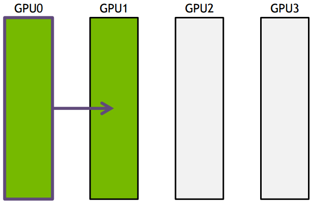
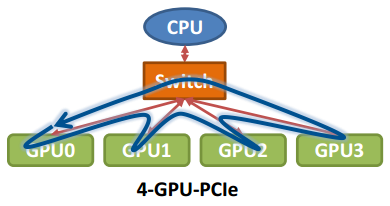
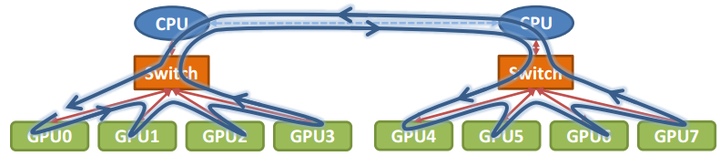
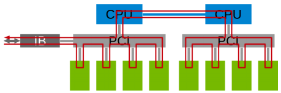

# NCCL

### Communication primitive

1. Point-to point communication (1 sender + 1 receiver)
2. Collective communication (multi-sender + multi-receiver): broadcast, gather, all-gather, scatter, reduce, all-reduce, reduce-scatter, all-to-all.

Receive data from multi-sender and combine to one node

<figure><figcaption>
Reduce
</figcaption></figure>

Receive data from multi-sender and combine to every node

<figure><figcaption>
All-reduce
</figcaption></figure>

Collective communication assumes the topology of nodes is a fat tree, which has highest communication efficiency. But real topology could be more complex, then ring-based collective communication is applied.

### Ring-based collectives

Ring-based collectives form a directed cyclic ring with all nodes and transmit data sequencially around the ring.&#x20;

<figure><figcaption>
GPU0 -> GPU1 -> GPU2 -> GPU3
</figcaption></figure>

Assume data is N, bandwidth is B, then total transmission time is (K - 1) N / B.

<figure><figcaption>
Transmit N/S data each time
</figcaption></figure>

Assume data is divided into N/S, then total time is S\*(N/S/B) + (k-2)\*(N/S/B) = N(S+K-2)/(SB). When S >> K, the time is N/B, which means communication time wont increase with number of nodes.&#x20;

How to form a ring:

<figure><figcaption>
Sngle node, 4 GPU with PCIe
</figcaption></figure>

<figure><figcaption>
Single node, 8 GPU with 2 PCIe switch
</figcaption></figure>

### NCCL implementation

* 3 primitives: Copy, Reduce, ReduceAndCopy
* Start from NCCL 2.0 supporting multi-node, multi-cards

<figure><figcaption>
Form communication ring
</figcaption></figure>

* Ring-based algorithm scales latency with number of GPUs. Thus, new algorithms like 2D ring algorithm introduced in NCCL 2.4 to replace flat ring algorithm.

### Practices

* \`torch.distributed()\` supports 3 native backend: NCCL, Gloo, MPI.&#x20;
* Suggested to use nightly build of NCCL (>=2.4) from source for ML model training.

### Reference




