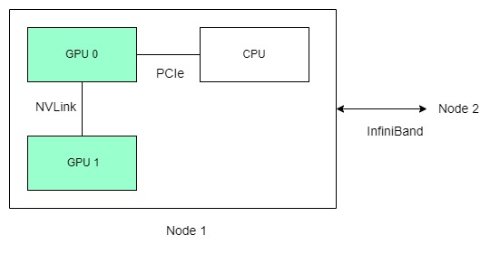

# PCIe, NVLink, InfiniBand

### PCIe (Peripheral Component Interconnect Express)

PCIe is a standard interface that allows for the connection of peripheral devices to a motherboard.&#x20;

* **Bandwidth**: PCIe lanes provide the bandwidth for data transfer between the GPU and the CPU or between GPUs and other devices. The bandwidth of PCIe is crucial for HPC and AI applications that need to transfer large datasets or models between system memory and the GPU.
* **Versions**: PCIe has various versions, with PCIe 4.0 and PCIe 5.0 being the more recent ones offering higher bandwidths. For example, PCIe 4.0 doubles the transfer rates compared to PCIe 3.0.
* **Scalability**: While PCIe is scalable and allows multiple GPUs to be connected in a single system, it does have bandwidth limitations when compared to NVIDIA's NVLink, especially in multi-GPU configurations that are common in HPC and AI.
* **Compatibility**: It is widely compatible with a multitude of devices beyond GPUs, making it a universal standard for expansion cards.

### NVLink

NVLink is NVIDIA's proprietary high-speed interconnect technology:

* **High Bandwidth**: NVLink provides significantly higher bandwidth than PCIe, enabling more rapid data sharing between GPUs or between GPUs and CPUs. This is particularly beneficial for HPC and AI tasks that require extensive parallel processing and data communication.
* **Multi-GPU Efficiency**: With NVLink, GPUs can share memory and work together more efficiently on complex tasks. This is especially important in AI, where processing large neural network models can benefit from the high-speed data exchange.
* **Reduced Latency**: NVLink reduces the communication latency between connected GPUs, which is essential for performance in HPC applications where timing is critical.
* **Scalability for Complex Workloads**: In an HPC-AI environment, where models and simulations can be extremely complex and data-intensive, NVLink allows for the construction of robust multi-GPU topologies that can handle such demands more effectively than PCIe alone.

**In HPC-AI Context:**

* NVLink is used within nodes for fast GPU interconnections.
* PCIe connects GPUs to motherboards and supports a variety of other peripherals.
* InfiniBand interconnects separate nodes in a cluster, enabling efficient communication and scaling for large-scale, distributed computations.

Practical configurations

* GPU-to-GPU: NVLink connections enable direct data paths between GPUs without involving the CPU, which minimizes latency and maximizes bandwidth. This is crucial for performance in systems where GPUs need to frequently share data.
* CPU-to-GPU: PCIe is used to connect GPUs to the CPU. The CPU sends data to the GPU for processing and receives results via this PCIe connection. Even though PCIe is slower than NVLink, it is sufficient for these purposes since the CPU-to-GPU data transfer does not typically need to be as frequent or as high-bandwidth as GPU-to-GPU communication.

In summary, NVLink excels in high-speed GPU communication, PCIe provides flexibility and compatibility within a wide range of devices, and InfiniBand is key for inter-node communication in large clusters, essential for advanced HPC and AI tasks. Each plays a crucial role in building HPC and AI systems, and they are often used together to balance communication needs within and across computing nodes.

<figure><figcaption></figcaption></figure>

### Server archs

<figure><figcaption>
NVLink Edition Servers
</figcaption></figure>

<figure><figcaption>
PCIe Edition Servers
</figcaption></figure>

### nvidia-smi topo -m

<figure><figcaption></figcaption></figure>

This picture shows that your system uses a combination of NVLink and PCIe connections for the GPUs and network interface cards (NICs).

#### GPU Interconnections:

• All the GPUs (GPU0 through GPU7) have NVLink connections (NV18) with each other. This indicates high-speed, low-latency connections suitable for intensive data transfer and parallel computations that are typical in clustered GPU setups.

• NV18 typically refers to the number of lanes or links available in the NVLink connection, suggesting a robust setup for GPU-to-GPU communication.

#### GPU to NIC Interconnections:

• The connections between the GPUs and the NICs (NIC0 through NIC9) show a mixture of connection types, including PIX, PXB, and SYS:

• PIX (Connection traversing at most a single PCIe bridge): This suggests a relatively direct connection between the device and the CPU over PCIe, likely implying lower latency and higher performance than PXB or SYS.

• PXB (Connection traversing multiple PCIe bridges): Indicates that the connection between the devices crosses multiple PCIe bridges, which can introduce more latency and potentially lower performance than PIX.

• SYS (System, involving traversal across the host bridge and possibly across multiple PCIe switches): This is generally the least direct connection type, involving multiple hops that can increase latency.

## Reference


