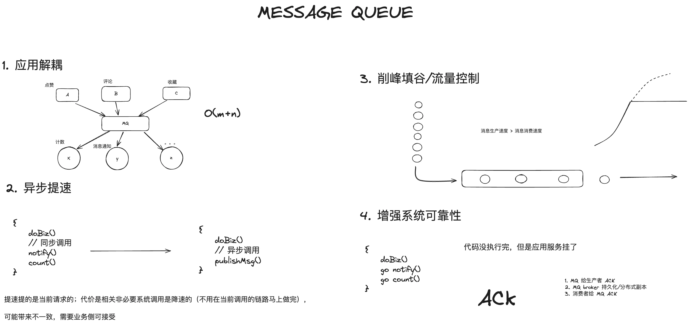

# Proxy vs. Reverse Proxy

## Forward Proxy Server&#x20;

It’s often referred to as just a proxy server. **This type of server resides in front of the clients and acts as a mediator between the clients and the servers.**&#x20;

<figure><figcaption></figcaption></figure>

The forward proxy ensures that the client request always goes through the proxy server first and then reaches the destination.&#x20;

One of the main purposes of the forward proxy is to process **outgoing** requests.

### Usages

* **Client Anonymity**: The forward proxy makes a request on behalf of the client. It masks the client’s IP address and provides client anonymity.
* **Content Filtering**: The forward proxy act as an entry point for all outgoing requests. This allows us to implement content filtering mechanisms like URL blocking.
* **Logging and Monitoring:** We can implement logging and monitoring with the forward proxy as all request goes through it.
* **Performance Improvement**:  The forward proxy can boost the performance by leveraging caching mechanism.

## Reverse Proxy Server

The [reverse proxy](https://www.baeldung.com/cs/api-gateway-vs-reverse-proxy) is part of the server-side infrastructure and resides in front of the web servers. It acts as an entry point for all **incoming** requests.&#x20;

<figure><figcaption></figcaption></figure>

The reverse proxy ensures that the client doesn’t communicate directly with the web servers. **One of the main purposes of the reverse proxy is to load balance the incoming requests**.

NGINX can also be used as Reverse proxy server.

### Usages

* **Server Anonymity**: The reverse proxy provides server anonymity.
* **DDoS Mitigation**: The reverse proxy helps us in mitigating DDoS attacks by throttling incoming requests.
* **Load Balancing**: The reverse proxy helps us in implementing load balancing by redirecting requests to different instances of the servers.
* **Stable Network Endpoint:** It provides a stable client endpoint over changing server instances’ endpoints. The server endpoint can be affected due to scale up/down or node failure/node repair activity.

### Difference

<figure><figcaption></figcaption></figure>

## References




