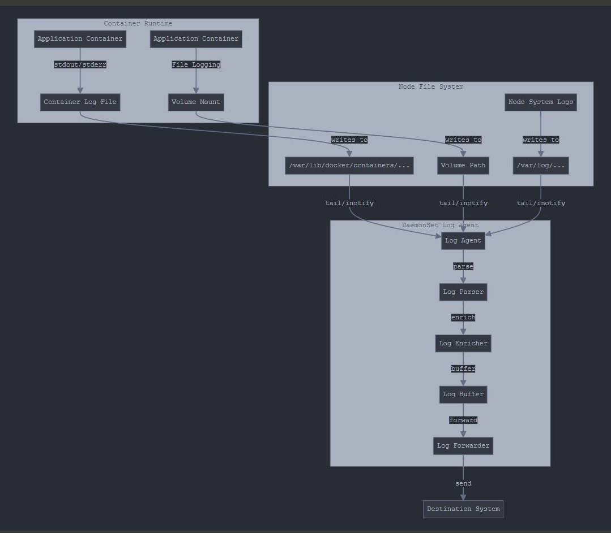

# wait() and notify()

* `Object.wait()` to suspend a thread
* `Object.notify()` to wake a thread up

<figure><figcaption></figcaption></figure>

### __[_wait()_ ](https://docs.oracle.com/javase/7/docs/api/java/lang/Object.html#wait\(\))

Simply put, calling _wait()_ forces the current thread to wait until some other thread invokes _notify()_ or _notifyAll()_ on the same object. For this, the current thread must own the object's [monitor](https://www.baeldung.com/cs/monitor). According to [Javadocs](https://docs.oracle.com/en/java/javase/11/docs/api/java.base/java/lang/Object.html#notify\(\)), this can happen in the following ways:

* when we've executed _synchronized_ instance method for the given object
* when we've executed the body of a _synchronized_ block on the given object
* by executing _synchronized static_ methods for objects of type _Class_

**Note that only one active thread can own an object's monitor at a time. There are three signature for wait()**

```java
wait();
wait(long timeout); // A timeout until thread woken up automatically
wait(long timeout, int nanos); // timeout in nanoseconds: 1_000_000*timeout + nanos.
```

### __[_notify()_](https://docs.oracle.com/javase/7/docs/api/java/lang/Object.html#notify\(\))__

We use the _notify()_ method for waking up threads that are waiting for an access to this object's monitor.

For all threads waiting on this object's monitor (by using any one of the _wait()_ methods), the method _notify()_ notifies any one of them to wake up arbitrarily. The choice of exactly which thread to wake is nondeterministic and depends upon the implementation.

Since _notify()_ wakes up a single random thread, we can use it to implement mutually exclusive locking where threads are doing similar tasks. But in most cases, it would be more viable to implement _notifyAll()_.

### __[_notifyAll()_](https://docs.oracle.com/javase/7/docs/api/java/lang/Object.html#notifyAll\(\))__

This method simply wakes all threads that are waiting on this object's monitor. The awakened threads will complete in the usual manner, like any other thread.

But before we allow their execution to continue, always **define a quick check for the condition required to proceed with the thread.** This is because there may be some situations where the thread got woken up without receiving a notification (this scenario is discussed later in an example).

### Sender-Receiver Synchronization Problem

Now that we understand the basics, let's go through a simple _Sender_–_Receiver_ application that will make use of the _wait()_ and _notify()_ methods to set up synchronization between them:

* The _Sender_ is supposed to send a data packet to the _Receiver_.
* The _Receiver_ cannot process the data packet until the _Sender_ finishes sending it.
* Similarly, the _Sender_ shouldn't attempt to send another packet unless the _Receiver_ has already processed the previous packet.

Let's first create a _Data_ class that consists of the data _packet_ that will be sent from _Sender_ to _Receiver_. We'll use _wait()_ and _notifyAll()_ to set up synchronization between them:

```java
public class Data {
    private String packet;
    
    // True if receiver should wait
    // False if sender should wait
    private static boolean transfer = true;
    
    public synchronized String receive() {
        while (transfer) {
            try {
                wait();
            } catch (InterruptedException e) {
                Thread.currentThread().interrupt();
                System.out.println("Thread Interrupted");
            }
        }
        transfer = true;
        
        String returnPacket = packet;
        notifyAll();
        return returnPacket;
    }
    
    public synchronized void send(String packet) {
        while (!transfer) {
            try {
                wait();
            } catch (InterruptedException e) {
                Thread.currentThread().interrupt();
                System.out.println("Thread Interrupted");
            }
        }
        transfer = false;
        
        this.packet = packet;
        notifyAll();
    }
}
```

#### Why Exclose _wait()_ with  a _while_ loop?

Since _notify()_ and _notifyAll()_ randomly wake up threads that are waiting on this object's monitor, it's not always important that the condition is met. Sometimes the thread is woken up, but the condition isn't actually satisfied yet.

We can also define a check to save us from spurious wakeups — where a thread can wake up from waiting without ever having received a notification.

#### Clients

```java
public class Sender implements Runnable {
    private Data data;
    
    @Override
    public void run() {
        String packets[] = {
          "First packet",
          "Second packet",
          "Third packet",
          "Fourth packet",
          "End"
        };
        
        for (String packet : packets) {
            data.send(packet);
            
            // Thread.sleep() to mimic heavy server-side processing
            try {
                Thread.sleep(ThreadLocalRandom.current().nextInt(1000, 5000));
            } catch (InterruptedException e) {
                Thread.currentThread().interrupt(); 
                Log.error("Thread interrupted", e); 
            }
        }
    } 
}
```

```java
public class Receiver implements Runnable {
    private Data load;
    
    @Override
    public void run() {
        for (String receivedMessage = load.receive(); 
            !"End".equals(receivedMessage);
            receivedMessage = load.receive()) {
            
            System.out.println(receivedMessage);
            
            try {
                Thread.sleep(ThreadLocalRandom.current().nextInt(1000, 5000));
            } catch (InterruptedException e) {
                Thread.currentThread().interrupt(); 
                Log.error("Thread interrupted", e); 
            }
        }
    }
```

```java
public static void main(String[] args) {
    Data data = new Data();
    Thread sender = new Thread(new Sender(data));
    Thread receiver = new Thread(new Receiver(data));
    
    sender.start();
    receiver.start();
}
```
