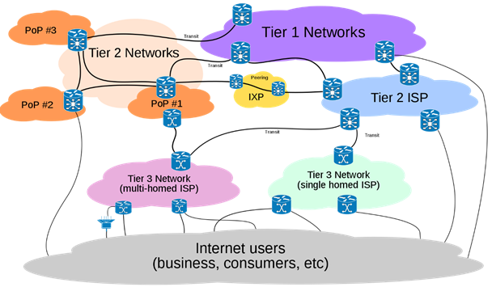

# Network Centric

### Overview of Internet

<figure><figcaption></figcaption></figure>

* **ISP (Internet Service Provider)**
* **IXPs (internet eXchange Points) / NAPs (Network Access Points).** Public locations where ISPs interconnect.
* **POP (Point of Presence).** Location where ISP houses its network hardware for subscribers to connect.

<figure><figcaption></figcaption></figure>

* **Protocol stack.** using layers to manager tasks - each layer uses services provided by lower layer to preform subtasks.

<figure><figcaption></figcaption></figure>

* Layers functionalities
  * Application layer
  * Transport layer: process-to-process communications
  * Network layer: host-to-host communications
  * Data link layer: node-to-node communications
  * Physical layer: actual transmissions
* Differ host-to-host and node-to-node: network layer decide next node to go, while data link layer takes care of data transmission on individual link.

<figure><figcaption></figcaption></figure>

* Port number: to identify a specific process running in a host computer
* IP address: to identify a specific host on a network of computers
* Link (MAC) address: to identify a specific node on a link

### Network layer - Internet protocol (IP)

*   **Network taxonomy**

    IP networks -> Datagram networks -> Packet-switched networks -> Switched networks
*   **Fragmentation.** Data is divided into suitable size packets depending on MTU (Maximum Transfer Unit) of individual network.

    

    
* About Internet Protocol
  * Addressing + Fragmentation
  * Connectionless unreliable best-effort service
    * Connectionless: each packet is handled independently, no flow control
    * Unreliable: no error control
    * Best-effort: no throughput guarantee, no delay guarantee, no Quality of Service (QoS) guarantee
*   IPv4 header

    

    * VER (version): version of IP is 4
    * HLEN (Internet Header Length): length of header in multiples of 4 bytes. 4x5=20 bytes
    * Total length: length of datagram including header. Max. 65535
    * Protocol: the protocol that IP is carrying. 0x01 for ICMP, 0x06 for TCP, 0x11 for UDP
    * Header checksum: verify the header is free from error.
    * Source/Destination IP address. (Most important)
*   IP address notation

    4 bytes / 32 bits / 5 classes

    

    A: 1.0.0.0 to 127.255.255.255

    B: 128.0.0.0 to 191.255.255.255

    C: 192.0.0.0 to 223.255.255.255
*   Special IPv4 addresses

    0.0.0.0 means this host on this network

    155.69.0.0 means the network/subnet ID

    255.255.255.255 limited broadcast within this network

    155.69.255.255 directed broadcast on 155.69.x.x network

    127.x.y.z loopback address.
*   Subnet

    

    *   Subnet Masks

        
    * a.b.c.d/x. x for number of bits for extended network prefix.
* IPv4 address exhaustion
  * Classless Inter-Domain Routing (short term solution)
  * Network Address Translation (NAT) using Private IP Addresses
  * IP version 6, 128-bit space
* CIDR
* NAT (network address translation)
* IPv6

### Network layer - IP routing protocols

*   **Router and Routing Protocol**

    Router. A device used to interconnect networks, and to forward packets by examining the destination address in the IP header of each packet.

    Routing Protocol. used to initialize/update routing table so that a route/path can be determined.
*   **Flooding**

    When a node receives a packet, it will forward the packet to all other links except the incoming link. The packet will be labelled with a unique identifier. Should the same packet return, the packet will be discarded.
*   **Autonomous Systems (AS)**

    Internet is divided by AS. An AS is a group of routers under the authority of a single administration.

    Each AS is identified by **ASN** (AS number) which is assigned by IANA. 2-byte or 4-byte.
*   **Intra-AS and Inter-AS**

    

    Inter-AS routing | Intra-AS routing

    * Routing within an AS | Routing between AS
    * Interior Gateway Protocols (IGPs) | Exterior Gateway Protocols (EGPs)
    * Different AS run their preferred protocols | All AS must run the same standard protocol

    
*   **Intra-AS Routing:** **Distance Vector Routing**

    Distance Vector routing also known as “Bellman-Ford” or “old ARPANET” routing.

    * Essentially, consists of 3 main stages:
      1. Discover neighbours by multicasting request
      2. Exchange distance vectors (routing information) with immediate neighbours only
         * Response to request
         * Periodic updates (typically 30s interval)
         * Triggered updates due to changes
      3. Compute shortest-path routes (using Bellman-Ford algorithm)
    *   Bellman-Ford algorithm

        
    * Count-to-Infinity problem
    *   Split Horizon with Poisoned Reverse

        

        If B gets to Net1 via A, then its update to A should indicate that Net1 is unreachable.
    * **Routing Information Protocol (RIP)**
      * RIP uses Distance Vector algorithm, cost is simply based on the number of hops
      * Allows maximum 15 hops, 16 indicates ∞
      * Routing information exchanged every 30 sec via Response Message
      * If no advertisement heard after 180 seconds -> neighbour/link declared dead
*   **Intra-AS Routing: Link State Routing**

    Received LSAs -> Link State DB --Dijkstra--> IP Routing Table

    Five stages:

    1. Discover Neighbours by multicasting Hello
    2.  Construct **Link State Advertisement Packet (LSA/LSP)**

        LSA/LSP contains information of itself and immediate neighbours only.
    3. Flood LSA/LSP to ALL Routers
       * During initial start-up
       * When there is a change in topology
    4.  Construct Link State DB

        Each router builds its own link state database to have a complete topology of the whole network.
    5. Compute Shortest-path routes (Dijkstra's algorithm)
    6. Update routing table (Optional)
* **Intra-AS Link State Routing: Open Shortest Path First (OSPF)**
  * “Open”: publicly available
  * Uses Link State algorithm
    * LSA packet dissemination
    * Topology map at each node
    * Route computation using Dijkstra’s algorithm
  * Advertisements disseminated to entire AS (via flooding)
*   **Inter-AS Path Vector Routing: Border Gateway Protocol (BGP)**

    * Three main stages:
      1.  Configure _border router_ to know its neighbours (External peers and Internal Peers)

          After configuration, BGP routers establish TCP connections with their neighbours to exchange routing information.
      2.  Exchange path vectors (routing information) with neighbours

          Peers exchange routing information containing complete AS Path (to avoid loop problem)
      3. Select path based on policy
         * Based on policy, BGP routers can decide to accept/decline offered paths; and to drop/ advertise paths to their neighbours.
         * Path selection policy based (Import policy and Export policy)
    *   Classification of AS

        

    ​ 

    * Commercial relationship of AS
      * Customer-Provider (c2p): Customer pays the provider to send and receive traffic
      * Peer-to-Peer (p2p): Two AS agree to transit each other traffic.

### Application layer - WWW & HTTP

* **World Wide Web (WWW).** A simply a network application which allows a client to access hypertext file from a server.
* **Web vs. Internet**
  * The Internet is a collection of computers and other devices connected by equipment that allows them to communicate with each other
  * The Web is a collection of software and protocols that run as applications of Internet (e.g., HyperText Transfer Protocol (HTTP), telnet, ftp)
* **Web vs. HTTP**
  * WWW allows a client to access a hypertext file from a server.
  * HTTP is the application layer protocol used by WWW, which is designed to run over TCP with server listening at port 80.
*   **Hyper Text Transfer Protocol (HTTP)**

    *   _**HTTP request**_

        [An argument about `PUT` and `POST`](https://stackoverflow.com/questions/630453/what-is-the-difference-between-post-and-put-in-http)

       

    *   _**HTTP response**_

          
    *   _**Non-persistent & Persistent HTTP**_

        Non-persistent HTTP: individual TCP connection/ termination for each pair of request/response to access one file – inefficient.

        

        Persistent HTTP: multiple request/response messages within one TCP connection – efficient for accessing multiple files in the same server.

        
    * Web client
      1. Java socket programming setup
      2. Constructing HTTP header
      3. Sending HTTP request via socket outputstream
      4. Receiving HTTP response vis socket inputstream
      5. Removing HTTP header and interpret accordingly
      6. Rendering HTML file
*   **Domain Name System (DNS)**

    

    * DNS is to resolve domain name - IP address resolution.
    * DNS protocol is designed to run over UDP with server listening at a well-known port 53.
    * _**gTLDs and ccTLDs**_ (commercial domain name registrars are accredited to sell them)
      * generic Top-Level Domains (gTLDs): only IANA/ICANN-accredited registrars are able to sell domain names under gTLDs.
      * country-code Top-Level Domains (ccTLDs): delegated to respective countries, e.g. only (Singapore) SGNIC-accredited registrars can sell domain names under .sg
    *   _**Hierarchical of domains.**_

        

        * Top-level domains are managed by IANA
        * 2nd-level domains are managed by respective organizations
        * 3rd-level domains are delegated further
    * **Fully qualified domain name (FQDN).** A completely specified domain name consisting of a host name and a domain. e.g. XLI072.student.main.ntu.edu.sg
    *   _**Hierarchy of name servers.**_

        
    * 13 root name servers but in reality more than 13 physical servers by **Anycast**.
    * **Anycast.** A group of servers are identified by the same IP address, and packets are routed to the nearest servers
*   **Uniform Resource Locator (URL)**

    
* **Web Proxy (cache)**
  * Why need Web Proxy
    * To improve performance by caching
    * Reduce traffic load on costly access link
    * _Monitor/Filter contents_
  *   How Web Proxy works

      1. Client requests to proxy
      2. (if content not available) proxy requests to origin server
      3. Origin server responds to proxy
      4. Proxy responds to client

      
  *   Basically, the organization/ISP configures its routers to intercept all Web traffic and re-direct (mis-direct) them to its Web proxy, which masquerades as the destination server

      
  * **Content Delivery/Distribution Network (CDN).** The service that improve performance of Web Proxy for content provider to use.
*   **Review**

    
