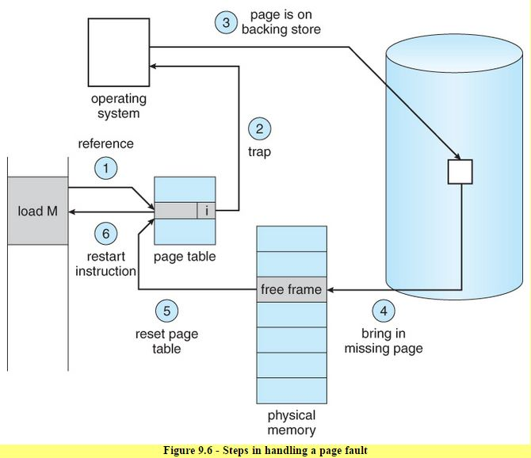

# Page Fault

<figure><figcaption></figcaption></figure>

In firecracker, page fault is either handled by operating system kernel or user space handler. The latter connects with firecracker VMM with a UFFD socket ([`userfaultfd`](https://man7.org/linux/man-pages/man2/userfaultfd.2.html)).

### Reference

[https://professormerwyn.wordpress.com/2015/10/16/steps-for-handling-page-fault/](https://professormerwyn.wordpress.com/2015/10/16/steps-for-handling-page-fault/)
